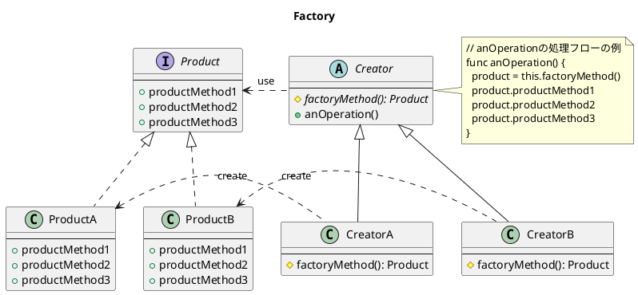

# テスト

```plantuml
@startuml
title Factory

interface Product {
  --
  + productMethod1
  + productMethod2
  + productMethod3
}

class ProductA {
  --
  + productMethod1
  + productMethod2
  + productMethod3
}

class ProductB {
  --
  + productMethod1
  + productMethod2
  + productMethod3
}

abstract class Creator {
  --
  # {abstract} factoryMethod(): Product
  + anOperation()
}

class CreatorA {
  --
  # factoryMethod(): Product
}

class CreatorB {
  --
  # factoryMethod(): Product
}

Creator <|-- CreatorA
Creator <|-- CreatorB
Product <|.. ProductA
Product <|.. ProductB
ProductA <. CreatorA : create
ProductB <. CreatorB : create
Product <. Creator : use


note right of Creator
  // anOperationの処理フローの例
  func anOperation() {
    product = this.factoryMethod()
    product.productMethod1
    product.productMethod2
    product.productMethod3
  }
end note
@enduml

```