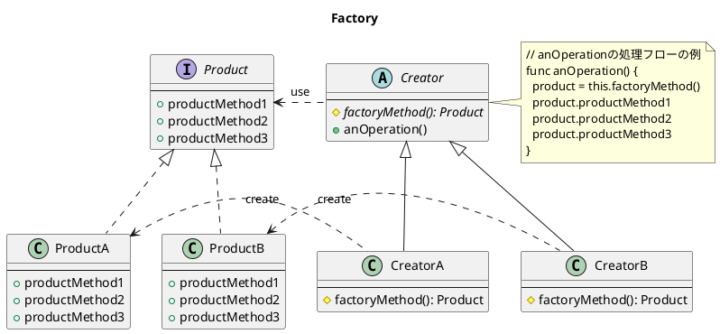

# テスト
## 使い方

### 準備

- `~/.aws/config` に profile が 設定されていること

```ini
[profile cli_user]
region = ap-northeast-1
```

- `~/.aws/credentials` に credentials が 設定されていること

```ini
; profile の後に ユーザー名
[cli_user]
aws_access_key_id = KEYIDDDDDDDDDDDD
aws_secret_access_key = SECRETaccessKEYYYYYYYYYYYYYYYYYY
```

### 実行
- 下記がPipfile に定義されている
- `execute` と実効すれば、実効できる

- ~/.bash_profile に下記のようにエイリアスを設定しておけば、pre で実行できる
```sh
# For pipenv
## use below with Pipfile scripts
alias pre="pipenv run execute"
alias prtc="pipenv run test"
```
```init
[scripts]
execute = "python3 -m set_aws_mfa"
```


