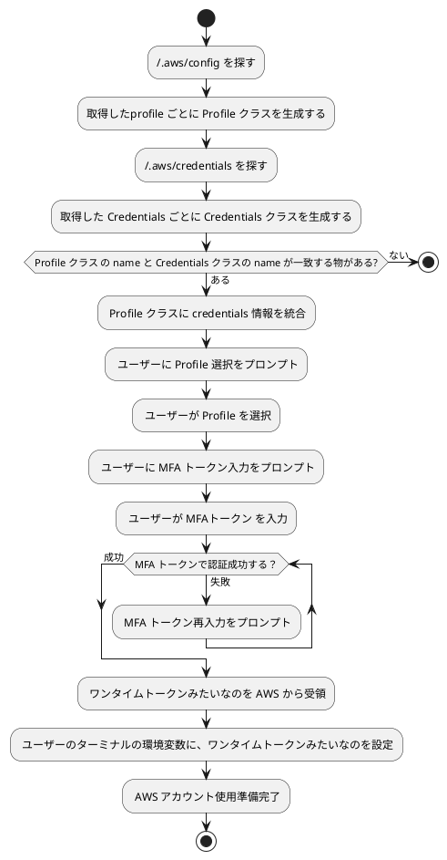

# アクティビティー図は、プロセスの状態を表現

* TDD を行うことを前提とした場合、アクティビティ図を書くことに意味がある？
 →

```plantuml
@startuml

start
:~/.aws/config を探す;
:取得したprofile ごとに Profile クラスを生成する;
:~/.aws/credentials を探す;
:取得した Credentials ごとに Credentials クラスを生成する;

if (Profile クラス の name と Credentials クラスの name が一致する物がある?) then (ある)
: Profile クラスに credentials 情報を統合;
: ユーザーに Profile 選択をプロンプト;
: ユーザーが Profile を選択;
: ユーザーに MFA トークン入力をプロンプト;
: ユーザーが MFAトークン を入力;
while (MFA トークンで認証成功する？) is (失敗)
    : MFA トークン再入力をプロンプト;
endwhile (成功)
: ワンタイムトークンみたいなのを AWS から受領;
: ユーザーのターミナルの環境変数に、ワンタイムトークンみたいなのを設定;
: AWS アカウント使用準備完了;
stop
else (ない)
    stop
@enduml
```
