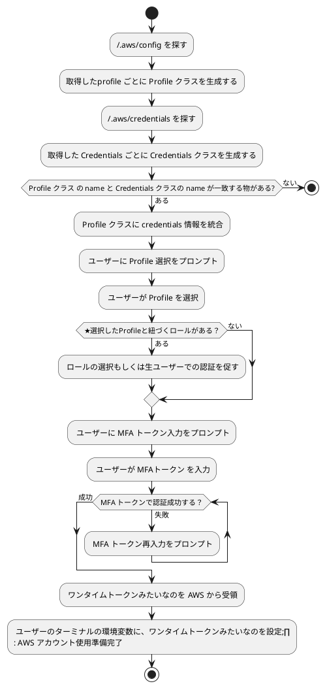
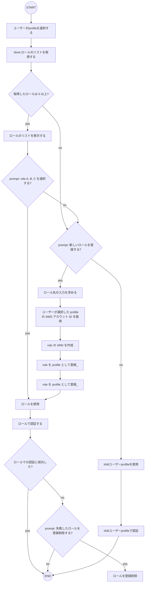

# アクティビティー図は、プロセスの状態を表現

* TDD を行うことを前提とした場合、アクティビティ図を書くことに意味がある？
 →

```plantuml
@startuml

start
:~/.aws/config を探す;
:取得したprofile ごとに Profile クラスを生成する;
:~/.aws/credentials を探す;
:取得した Credentials ごとに Credentials クラスを生成する;

if (Profile クラス の name と Credentials クラスの name が一致する物がある?) then (ある)
: Profile クラスに credentials 情報を統合;
: ユーザーに Profile 選択をプロンプト;
: ユーザーが Profile を選択;

if (★選択したProfileと紐づくロールがある？) then (ある)
	: ロールの選択もしくは生ユーザーでの認証を促す;
else (ない)
endif
	: ユーザーに MFA トークン入力をプロンプト;
	: ユーザーが MFAトークン を入力;
while (MFA トークンで認証成功する？) is (失敗)
    : MFA トークン再入力をプロンプト;
endwhile (成功)
: ワンタイムトークンみたいなのを AWS から受領;
: ユーザーのターミナルの環境変数に、ワンタイムトークンみたいなのを設定;∏
: AWS アカウント使用準備完了;
stop
else (ない)
    stop
@enduml

```

## ロールを選択する部分

```mermaid
graph TB

Start((START)) -->

B[ユーザーがprofileを選択する]
 -->
 GetRollList[done:ロールのリストを取得する]
-->
IfRollListIsNotZero{取得したロールは 0 以上?}
-- no --> ifB
IfRollListIsNotZero -- yes -->
PromptRollList[ロールのリストを表示する]
-->
%% 分岐1
ifA{prompt: role A, B, C を選択する?}
%% 分岐1-1
ifA -- yes --> resA[ロールを使用]
resA --> D[ロールで認証する]
%% 分岐
D --> ifC{ロールでの認証に成功した?}
ifC -- yes -->L
%% 分岐
ifC -- no --> ifD{prompt: 失敗したロールを登録削除する?}
ifD -- yes --> M[ロールを登録削除]
ifD -- no --> L
%% 分岐1-2 --> 分岐2
ifA -- no --> ifB{prompt: 新しいロールを登録する?}


%% 分岐2-1
ifB -- yes --> E[ロール名の入力を求める]
--> F[ユーザーが選択した profileの AWS アカウント ID を取得]
--> G[role の ARN を作成]
--> H[role を profile として登録_]
--> I[role を profile として登録_]
--> resA

%% 分岐2-2
ifB -- no --> J[IAMユーザーprofileを使用]
--> K[IAMユーザーprofileで認証]
--> L((END))
```