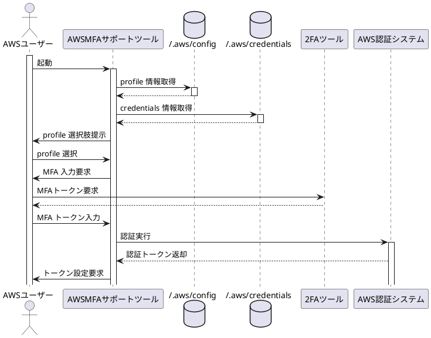

```plantuml
@startuml
actor AWSユーザー as user
participant AWSMFAサポートツール as mfa_support
database "~/.aws/config" as aws_config
database "~/.aws/credentials" as aws_credentials
participant 2FAツール as 2fa
participant AWS認証システム as aws_auth


activate user
user -> mfa_support: 起動
activate mfa_support
mfa_support -> aws_config ++ : profile 情報取得
return
mfa_support -> aws_credentials ++ : credentials 情報取得
return

user <- mfa_support: profile 選択肢提示
user -> mfa_support: profile 選択
user <- mfa_support: MFA 入力要求
user -> 2fa: MFAトークン要求
user <-- 2fa
user -> mfa_support: MFA トークン入力
mfa_support -> aws_auth ++ : 認証実行
mfa_support <-- aws_auth: 認証トークン返却
user <- mfa_support: トークン設定要求
@enduml
```

